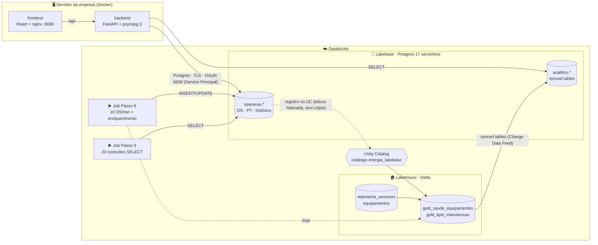

<h1 align="center">🛢️ Workshop Databricks Lakebase — Manutenção de Ativos Offshore</h1>

<p align="center">
  <b>Um único ecossistema para o TRANSACIONAL e o ANALÍTICO</b><br/>
  App em Docker (fora do Databricks) ⇄ Lakebase (Postgres serverless) ⇄ Lakehouse (Delta + Unity Catalog)
</p>

<p align="center">
  
  
  
  
  
</p>

A **Brickhouse Energia** é uma operadora **fictícia** com 3 FPSOs (*Atlântico, Guanabara, Tupinambá*) e 45 equipamentos críticos.
O time de manutenção usa um app — **em Docker, no servidor da empresa, como todas as aplicações de hoje** — para abrir
**Ordens de Serviço (OS)** e aprovar **Permissões de Trabalho (PT)**.

Neste roteiro você tira o `postgres` de dentro do `docker-compose.yml`, coloca o banco no **Lakebase** e vê o que ganha:
o dado transacional fica **visível e governado no Lakehouse**, e a inteligência do Lakehouse (health score, KPIs) **volta para o app** —
sem ETL, sem cópias manuais, sem outro banco para administrar.

---

## 📋 Roteiro

| Passo | O que você faz | Onde | ⏱️ |
|---|---|---|---|
| ⚙️ **0** | Preparar: publicar os notebooks e gerar os dados que "já existem" no Lakehouse | terminal + notebook | 10 min |
| 1️⃣ **a** | **Criar o projeto Lakebase** — Postgres 17 serverless, autoscaling 0,5–4 CU, scale-to-zero | [notebook](01_Criar_Projeto_Lakebase/01_criar_projeto_lakebase.py) | 5 min |
| 2️⃣ **b** | **Criar o database e as tabelas** — roles, schema `operacao`, constraints, 90 dias de dados | [notebook](02_Criar_Database_e_Tabelas/02_criar_database_e_tabelas.py) | 10 min |
| 3️⃣ **c** | **Registrar no Unity Catalog** — o OLTP consultável no Lakehouse, ao vivo e sem cópia | [notebook](03_Registrar_no_Unity_Catalog/03a_registrar_catalogo.py) | 10 min |
| 4️⃣ **d** | **Enriquecer no Lakehouse** — telemetria Delta ⨝ OS do Lakebase → health score e KPIs (gold) | [notebook](04_Enriquecimento_Lakehouse/04_camada_gold.py) | 10 min |
| 5️⃣ **e** | **Synced tables** — o gold replicado de volta para o Lakebase (`analitico.*`) | [notebook](05_Synced_Tables/05a_criar_synced_tables.py) | 10 min |
| 6️⃣ **f** | **Criar o Service Principal** (identidade do app) e o secret OAuth | [README](06_Service_Principal_e_Grants/README.md) | 5 min |
| 6️⃣ **e′** | **Grants ao Service Principal** — `CAN_USE`, role OAuth no Postgres, `GRANT energia_app` | [notebook](06_Service_Principal_e_Grants/06_grants_service_principal.py) | 5 min |
| 7️⃣ **g** | **Build do projeto local** — `.env`, `docker compose build` e `up` | [README](07_App_Local/README.md) | 10 min |
| 7️⃣ **h** | **Explorar a aplicação** — painel, OS, PT, lock otimista, segregação de funções | [README](07_App_Local/README.md#74--explorar-a-aplicação-roteiro-de-10-min) | 10 min |
| 8️⃣ **i** | ▶️ **Job contínuo: 10 OS/min + enriquecimento** — o loop OLTP → Lakehouse → OLTP ao vivo | job `Passo 8` | 10 min |
| 9️⃣ **j** | ▶️ **Job de carga: 20 conexões simultâneas de SELECT** — autoscaling e observabilidade | job `Passo 9` | 10 min |
| | **Total** | | **~1h45** |

Extras opcionais: 🧪 [branching + migração de schema](Extras/E1_branching_migracao.py) · 😴 [scale-to-zero](Extras/E2_scale_to_zero.py).

---

## 🏗️ Arquitetura



1. **O dado nasce no Lakebase** — o app grava OS e PT no schema `operacao` (Postgres puro: transações, `FOR UPDATE`, `CHECK`, `UNIQUE`).
2. **O Unity Catalog enxerga o OLTP** — o database vira o catálogo `energia_lakebase`: SQL, notebooks, dashboards e Genie leem o transacional **ao vivo**.
3. **O Lakehouse gera inteligência** — telemetria (Delta) ⨝ OS (Lakebase) → **health score**, risco de falha, MTTR, backlog, disponibilidade.
4. **A inteligência volta para o app** — synced tables mantêm o gold dentro do Postgres; o técnico vê o risco e abre uma **OS preditiva** com 1 clique. 🔁

---

## 🔧 Pré-requisitos

**Workspace Databricks** com Unity Catalog, Lakebase e serverless (notebooks/jobs). Um catálogo com `CREATE SCHEMA`
(👉 **ALTERE** o widget/variável `catalogo` — padrão `gabriel_dev`) e **admin do workspace** para criar o Service Principal (Passo 6).

**Máquina que roda o app**
- **VPN Databricks** ligada (o build usa os proxies internos de PyPI/npm — já configurados no `.env.example` e no `package-lock.json`).
- **Docker Engine + Compose** — macOS: `brew install docker docker-compose colima` e `colima start --cpu 4 --memory 6` · Linux: `docker-ce` + `docker-compose-plugin`.
- **Databricks CLI** autenticado: `databricks auth login --host https://<workspace> --profile workshop`.

---

## 🚀 Passo a passo

### ⚙️ Passo 0 — Preparar
```bash
git clone <este-repositório> && cd lakebase-demo
databricks bundle deploy -p workshop          # publica os notebooks e cria os jobs dos Passos 8 e 9
```
No workspace: **Workspace › Users › você › .bundle › lakebase-energia-workshop › dev › files** (ou importe o repositório como **Git folder**).
1. Abra [`00_Setup/00_configuracao`](00_Setup/00_configuracao.py) e confira os nomes (👉 **ALTERE** `catalogo`).
2. Rode [`00_Setup/01_gerar_dados_lakehouse`](00_Setup/01_gerar_dados_lakehouse.py) em **serverless** — cadastro de 45 equipamentos e ~194 mil leituras de telemetria (Delta), com 6 equipamentos degradando.

✅ `gabriel_dev.lakebase_workshop.equipamentos` e `telemetria_sensores` no Catalog Explorer.

### 1️⃣ Passo 1 (a) — Criar o projeto Lakebase
[`01_criar_projeto_lakebase`](01_Criar_Projeto_Lakebase/01_criar_projeto_lakebase.py): projeto `energia-workshop` (JSON idêntico ao do CLI/API), endpoint e host de conexão.
✅ Endpoint **ACTIVE** em < 1 min, 0,5–4 CU. 💬 *"Postgres gerenciado, sem VM, sem patch, sem backup para administrar."*

### 2️⃣ Passo 2 (b) — Criar o database e as tabelas
[`02_criar_database_e_tabelas`](02_Criar_Database_e_Tabelas/02_criar_database_e_tabelas.py): database `energia`, role de aplicação `energia_app`,
schema `operacao`, as **mesmas migrações do app** ([`migrations/`](app/backend/migrations/)) e 90 dias de dados em SQL ([`seed_demo.sql`](app/backend/sql/seed_demo.sql)).
✅ 300 OS, ~270 PTs, ~2.450 eventos de auditoria. 💬 *"As regras de negócio vivem no banco — CHECK, UNIQUE parcial, lock otimista."*

### 3️⃣ Passo 3 (c) — Registrar no Unity Catalog
[`03a_registrar_catalogo`](03_Registrar_no_Unity_Catalog/03a_registrar_catalogo.py) → catálogo `energia_lakebase`; [`03b_consultas_federadas`](03_Registrar_no_Unity_Catalog/03b_consultas_federadas.py) → OLTP ⨝ telemetria na mesma consulta.
✅ `SELECT … FROM energia_lakebase.operacao.ordens_servico` no SQL Editor. 💬 *"O transacional já está no Lakehouse — sem pipeline, sem cópia."*

### 4️⃣ Passo 4 (d) — Enriquecer no Lakehouse
[`04_camada_gold`](04_Enriquecimento_Lakehouse/04_camada_gold.py): health score por equipamento e KPIs por FPSO (`MERGE`, Change Data Feed ligado).
✅ `ATL-K-2101A` 🔴 CRITICO (vibração +116%), 3 equipamentos 🟠 ALTO.

### 5️⃣ Passo 5 (e) — Synced tables (Lakehouse → Lakebase)
[`05a_criar_synced_tables`](05_Synced_Tables/05a_criar_synced_tables.py): 4 synced tables em `energia_lakebase.analitico.*` + `GRANT` para `energia_app`.
✅ 4 tabelas `ONLINE`; `SELECT` no Postgres já traz o health score. 💬 *"Reverse ETL sem código, governado no Unity Catalog."*

### 6️⃣ Passo 6 (f + e′) — Service Principal e grants
[README](06_Service_Principal_e_Grants/README.md): crie o SP `energia-app-sp` e o secret (UI) → [`06_grants_service_principal`](06_Service_Principal_e_Grants/06_grants_service_principal.py) com o Client ID:
`CAN_USE` no projeto · `databricks_create_role('<client-id>', 'service_principal')` · `GRANT energia_app TO "<client-id>"`.
✅ Verificação com ✅ em `INSERT` (operacao) e `SELECT` (analitico). 💬 *"O app não tem senha de banco: tem uma identidade governada."*

### 7️⃣ Passo 7 (g + h) — Build e exploração do app
[README](07_App_Local/README.md):
```bash
cp app/.env.example app/.env        # preencha DATABRICKS_HOST, CLIENT_ID/SECRET (Passo 6) e PGHOST (Passo 1)
cd app && docker compose build && docker compose up -d
open http://localhost:8080
```
✅ Header `branch: production · OAuth M2M · schema v2`; roteiro de exploração em [7.4](07_App_Local/README.md#74--explorar-a-aplicação-roteiro-de-10-min).

### 8️⃣ Passo 8 (i) — ▶️ Simulação contínua: 10 OS/min + enriquecimento
**Jobs & Pipelines › `Passo 8 · Simulação contínua` › ▶ Run now** (ou `databricks bundle run passo8_simulacao_continua -p workshop`). Duas tarefas em paralelo:

| Tarefa | O que faz |
|---|---|
| [`simular_operacao`](08_Simulacao_Continua/08a_simulador_operacao.py) | abre **10 OS/min** (mais corretivas nos equipamentos em risco) e anda o fluxo: planejar → PT → aprovar → executar → concluir |
| [`enriquecimento_continuo`](08_Simulacao_Continua/08b_enriquecimento_continuo.py) | em loop: gold (Passo 4) lendo o OLTP via UC → refresh das synced tables → app atualizado |

✅ No app: OS novas chegando no **Painel** e no kanban de **PTs**; a cada volta (~2–3 min) backlog, MTTR e risco mudam na seção do Lakehouse.
💬 *"O transacional alimenta o analítico, que devolve inteligência ao transacional — continuamente, na mesma plataforma."*
Pare com **Cancel run** (padrão: 60 min).

### 9️⃣ Passo 9 (j) — ▶️ Carga de leitura: 20 conexões simultâneas
**Jobs & Pipelines › `Passo 9 · Carga de leitura` › ▶ Run now** ([`09_carga_leitura`](09_Carga_Leitura/09_carga_leitura.py)): 20 conexões com as consultas do app
(KPIs, listas, buscas, agregações, synced tables) por 10 min.
✅ Lakebase › **Monitoring**: CPU/RAM alocados subindo (autoscaling); app › **Conexão Lakebase**: latência estável; `pg_stat_statements` no fim.
💬 *"Escala sozinho com a carga — e volta a zero quando ninguém usa."*

---

## 🔐 Como o app (fora do Databricks) se autentica

| `LAKEBASE_AUTH_MODE` | Identidade | Senha do Postgres | Quando usar |
|---|---|---|---|
| `oauth` *(padrão)* | **Service Principal** (OAuth M2M: `DATABRICKS_CLIENT_ID/SECRET`) | token do Lakebase gerado pelo SDK, **1 h**, renovado automaticamente | produção — sem senha estática, auditável |
| `password` | role Postgres nativa `app_energia` | `PGPASSWORD` | "só troque a connection string"; ferramentas legadas |
| `profile` | seu usuário (Databricks CLI) | token OAuth do usuário | desenvolvimento, backend fora do Docker |

O token só é validado no **login**: o pool (`psycopg_pool`) recicla conexões a cada 45 min e cada conexão nova recebe um token válido
([`app/backend/app/db.py`](app/backend/app/db.py)).

## 📊 Modelo de dados

| Objeto | Onde | Escrito por | Descrição |
|---|---|---|---|
| `operacao.ordens_servico` | Lakebase | app, simulador | fluxo `ABERTA → PLANEJADA → AGUARDANDO_PT → EM_EXECUCAO → CONCLUIDA`, lock otimista (`version`) |
| `operacao.permissoes_trabalho` | Lakebase | app, simulador | aprovação; **segregação de funções** e **1 PT ativa por OS** garantidas por constraints |
| `operacao.historico_status` | Lakebase | app, simulador | trilha de auditoria append-only |
| `operacao.usuarios` | Lakebase | seed | técnicos, supervisores, segurança, planejamento |
| `equipamentos` · `telemetria_sensores` | Delta | Passo 0 | cadastro mestre (simula ERP) e historian (10 min × 30 dias) |
| `gold_saude_equipamentos` · `gold_kpis_manutencao` · `gold_telemetria_diaria` | Delta | Passo 4 / 8 | health score, risco, recomendação · backlog, MTTR, disponibilidade · tendência |
| `analitico.*` | Lakebase | **synced tables** | cópias somente leitura do gold + cadastro, servidas ao app |

## 📁 Estrutura

```
├── 00_Setup/                         ⚙️ configuração (nomes) + dados do Lakehouse
├── 01_Criar_Projeto_Lakebase/        a · projeto, endpoint, primeira conexão
├── 02_Criar_Database_e_Tabelas/      b · database, roles, migrações, dados de demonstração
├── 03_Registrar_no_Unity_Catalog/    c · catálogo energia_lakebase + consultas federadas
├── 04_Enriquecimento_Lakehouse/      d · camada gold (health score, KPIs)
├── 05_Synced_Tables/                 e · synced tables + uma volta manual do loop
├── 06_Service_Principal_e_Grants/    f · criar SP (README) · e′ · grants (notebook)
├── 07_App_Local/                     g · build · h · exploração (README)
├── 08_Simulacao_Continua/            i · job: simulador 10 OS/min + enriquecimento contínuo
├── 09_Carga_Leitura/                 j · job: 20 conexões simultâneas de SELECT
├── Extras/                           branching + migração · scale-to-zero
├── 99_Cleanup/                       limpeza do workspace e dos containers
├── app/                              docker-compose.yml · backend (FastAPI) · frontend (React) · API.md
├── scripts/                          checar_conectividade.sh · psql_lakebase.sh · criar_service_principal.sh (atalho opcional)
├── dados/equipamentos.csv
├── databricks.yml                    bundle: notebooks + jobs
└── guia_apresentador.md              roteiro da apresentação (slide → passo → mensagem)
```

## 🧹 Limpeza
[`99_Cleanup/99_limpeza`](99_Cleanup/99_limpeza.py) (`confirmar = sim`) · `./99_Cleanup/limpar_local.sh` · `databricks bundle destroy -p workshop`.

## 🧯 Problemas comuns

| Sintoma | Causa / solução |
|---|---|
| App mostra "Lakebase acordando…" | compute voltando do scale-to-zero — o app tenta de novo sozinho (1ª conexão ~1 s) |
| Badge "CSV local" depois do Passo 5 | falta o `GRANT` da célula final do `05a` (repita sempre que recriar uma synced table) |
| `password authentication failed` no modo `oauth` | SP sem `CAN_USE` no projeto ou sem role no Postgres → refaça o Passo 6b |
| `docker compose build` falha no `pip install`/`npm ci` | VPN desligada (proxies internos) — fora da VPN, remova `PIP_INDEX_URL` do `.env` e troque o registry do `package-lock.json` |
| Porta 5432 bloqueada | libere saída TCP 5432 para `*.database.<região>.azuredatabricks.net` (`scripts/checar_conectividade.sh`) |
