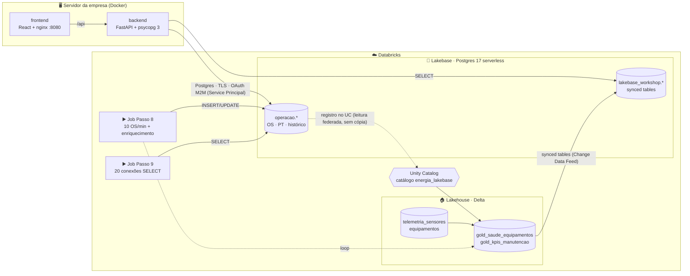

<h1 align="center">🛢️ Workshop Databricks Lakebase — Manutenção de Ativos Offshore</h1>

<p align="center">
  <b>Um único ecossistema para o TRANSACIONAL e o ANALÍTICO</b><br/>
  App em Docker (fora do Databricks) ⇄ Lakebase (Postgres serverless) ⇄ Lakehouse (Delta + Unity Catalog)
</p>

<p align="center">
  
  
  
  
  
</p>

A **Brickhouse Energia** é uma operadora **fictícia** com 3 FPSOs (*Atlântico, Guanabara, Tupinambá*) e 45 equipamentos críticos.
O time de manutenção usa um app para abrir **Ordens de Serviço (OS)** e aprovar **Permissões de Trabalho (PT)**. O app roda em
**Docker, no servidor da empresa, como todas as aplicações de hoje**.

Neste roteiro você tira o `postgres` de dentro do `docker-compose.yml`, coloca o banco no **Lakebase** e vê o que ganha:
- o dado transacional fica **visível e governado no Lakehouse**;
- a inteligência do Lakehouse (health score, KPIs) **volta para o app**;
- tudo isso sem ETL, sem cópias manuais e sem outro banco para administrar.

> 🖱️ **Tudo é criado pela UI:** projeto, database, catálogo, synced tables, Service Principal e grants. Os notebooks só **processam dados**
> (gerar o Lakehouse, enriquecer). Os dois jobs finais são publicados com um `databricks bundle deploy`.

---

## 📋 Roteiro

| Passo | O que você faz | Como | ⏱️ |
|---|---|---|---|
| ⚙️ **0** | Trazer os notebooks para o workspace e gerar os dados que "já existem" no Lakehouse | Git folder + notebook | 10 min |
| 1️⃣ **a** | **Criar o projeto Lakebase** — Postgres 17 serverless, autoscaling 0,5–4 CU, scale-to-zero | 🖱️ UI · [guia](01_Criar_Projeto_Lakebase/README.md) | 5 min |
| 2️⃣ **b** | **Criar o database e as tabelas** — roles, schema `operacao`, constraints, 90 dias de dados | 🖱️ UI + SQL Editor · [guia](02_Criar_Database_e_Tabelas/README.md) | 10 min |
| 3️⃣ **c** | **Registrar no Unity Catalog** — o OLTP consultável no Lakehouse, ao vivo e sem cópia | 🖱️ UI · [guia](03_Registrar_no_Unity_Catalog/README.md) | 10 min |
| 4️⃣ **d** | **Enriquecer no Lakehouse** — telemetria Delta ⨝ OS do Lakebase → health score e KPIs (gold) | ▶ [notebook](04_Enriquecimento_Lakehouse/04_camada_gold.py) | 10 min |
| 5️⃣ **e** | **Synced tables** — o gold replicado de volta para o Lakebase | 🖱️ UI · [guia](05_Synced_Tables/README.md) | 10 min |
| 6️⃣ **f** | **Criar o Service Principal** (identidade do app) e o secret OAuth | 🖱️ UI · [guia](06_Service_Principal_e_Grants/README.md) | 5 min |
| 6️⃣ **e′** | **Grants ao Service Principal** — `CAN USE`, role OAuth, `GRANT energia_app` | 🖱️ UI + SQL Editor · [guia](06_Service_Principal_e_Grants/README.md#6b--e-grants-o-que-o-service-principal-pode-fazer) | 5 min |
| 7️⃣ **g** | **Build do projeto local** — `.env`, `docker compose build` e `up` | 💻 terminal · [guia](07_App_Local/README.md) | 10 min |
| 7️⃣ **h** | **Explorar a aplicação** — painel, OS, PT, lock otimista, segregação de funções | 🌐 app · [guia](07_App_Local/README.md#74--explorar-a-aplicação-roteiro-de-10-min) | 10 min |
| 8️⃣ **i** | ▶️ **Job contínuo: 10 OS/min + enriquecimento** — o loop OLTP → Lakehouse → OLTP ao vivo | job (bundle) | 10 min |
| 9️⃣ **j** | ▶️ **Job de carga: 20 conexões simultâneas de SELECT** — autoscaling e observabilidade | job (bundle) | 10 min |
| | **Total** | | **~1h45** |

Extras opcionais pela UI ([guia](Extras/README.md)): 🧪 branching + migração de schema · 😴 scale-to-zero.

---

## 🏗️ Arquitetura



1. **O dado nasce no Lakebase:** o app grava OS e PT no schema `operacao`, com Postgres puro: transações, `FOR UPDATE`, `CHECK`, `UNIQUE`.
2. **O Unity Catalog enxerga o OLTP:** o database vira o catálogo `energia_lakebase`. SQL, notebooks, dashboards e Genie leem o transacional **ao vivo**.
3. **O Lakehouse gera inteligência:** telemetria (Delta) ⨝ OS (Lakebase) → **health score**, risco de falha, MTTR, backlog, disponibilidade.
4. **A inteligência volta para o app:** as synced tables mantêm o gold dentro do Postgres. O técnico vê o risco e abre uma **OS preditiva** com 1 clique. 🔁

---

## 🔧 Pré-requisitos

- **Workspace Databricks** com Unity Catalog, Lakebase e serverless. Você precisa de um catálogo com `CREATE SCHEMA`
  (👉 **ALTERE** `catalogo` no `00_configuracao`, padrão `gabriel_dev`) e ser **admin do workspace** para criar o Service Principal (Passo 6).
- **VPN Databricks** ligada: o build usa os proxies internos de PyPI e npm.
- **Docker Engine + Compose.**
  - macOS: `brew install docker docker-compose colima` e depois `colima start --cpu 4 --memory 6`.
  - Linux: `docker-ce` + `docker-compose-plugin`.
- **Databricks CLI** autenticado, só para os jobs dos Passos 8 e 9: `databricks auth login --host https://<workspace> --profile <perfil>`.

---

## 🚀 Passo a passo

### ⚙️ Passo 0 — Notebooks no workspace e dados do Lakehouse
1. Traga o repositório para o workspace:
   - **Opção A (recomendada):** **Workspace** › **Create** › **Git folder** › URL do repositório.
   - **Opção B (sem Git):** no terminal, importe só as pastas com notebooks e dados:
     ```bash
     for d in 00_Setup 03_Registrar_no_Unity_Catalog 04_Enriquecimento_Lakehouse 05_Synced_Tables 99_Cleanup dados; do
       databricks workspace import-dir $d /Workspace/Users/<seu-email>/lakebase-workshop/$d -p <perfil>
     done
     ```
2. Abra [`00_Setup/00_configuracao`](00_Setup/00_configuracao.py) e confira os nomes (👉 **ALTERE** `catalogo`).
3. Execute [`00_Setup/01_gerar_dados_lakehouse`](00_Setup/01_gerar_dados_lakehouse.py) em **serverless**. Ele cria o schema `lakebase_workshop`,
   o cadastro de 45 equipamentos e ~194 mil leituras de telemetria, com 6 equipamentos degradando.

✅ `gabriel_dev.lakebase_workshop.equipamentos` e `telemetria_sensores` no Catalog Explorer.

### 1️⃣ Passo 1 (a) — Criar o projeto Lakebase · [guia](01_Criar_Projeto_Lakebase/README.md)
- Seletor de apps › **Lakebase Postgres** › **Autoscaling** › **New project** › `energia-workshop`, Postgres 17.
- ⚠️ Depois, **Computes** › **Edit** › **0,5–4 CU**, scale-to-zero de 1 h. O compute nasce com 8–16 CU.
- **Connect** › anote o **host**.

### 2️⃣ Passo 2 (b) — Database, roles e tabelas · [guia](02_Criar_Database_e_Tabelas/README.md)
- **Roles & Databases** › **Add database** › `energia`.
- No **SQL Editor**, cole e execute, nesta ordem:
  1. [`2b_roles_e_schema.sql`](02_Criar_Database_e_Tabelas/2b_roles_e_schema.sql)
  2. [`001_schema_oltp.sql`](app/backend/migrations/001_schema_oltp.sql)
  3. [`002_indices_e_comentarios.sql`](app/backend/migrations/002_indices_e_comentarios.sql)
  4. [`seed_demo.sql`](app/backend/sql/seed_demo.sql)

✅ 300 OS, todas as tabelas com dono `energia_app`.

### 3️⃣ Passo 3 (c) — Registrar no Unity Catalog · [guia](03_Registrar_no_Unity_Catalog/README.md)
- **Catalog** › **+** › **Create a catalog** › `energia_lakebase` › tipo **Lakebase Postgres** › **Autoscaling** › projeto / `production` / `energia`.
- Consulte `energia_lakebase.operacao.ordens_servico` no SQL Editor.
- Execute o notebook [`03_consultas_federadas`](03_Registrar_no_Unity_Catalog/03_consultas_federadas.py).

### 4️⃣ Passo 4 (d) — Enriquecer no Lakehouse
Execute [`04_camada_gold`](04_Enriquecimento_Lakehouse/04_camada_gold.py) em serverless. Ele calcula health score e KPIs por FPSO,
lendo as OS **ao vivo** pelo catálogo do Passo 3.
✅ `ATL-K-2101A` 🔴 CRITICO (vibração +116%), 3 equipamentos 🟠 ALTO.

### 5️⃣ Passo 5 (e) — Synced tables · [guia](05_Synced_Tables/README.md)
- Catalog Explorer › tabela de origem › **Create** › **Synced table**, para as 4 tabelas: `cadastro_equipamentos`, `saude_equipamentos`,
  `kpis_manutencao` e `telemetria_diaria`.
- Depois, rode no SQL Editor o GRANT [`5b_grant_synced_tables.sql`](05_Synced_Tables/5b_grant_synced_tables.sql).

✅ 4 tabelas `Online`. No Postgres elas ficam em `lakebase_workshop.*`.

### 6️⃣ Passo 6 (f + e′) — Service Principal e grants · [guia](06_Service_Principal_e_Grants/README.md)
- **Settings** › **Identity and access** › **Service principals** › `energia-app-sp` › **Generate secret**.
- No projeto:
  - **Settings** › **Project permissions** › **CAN USE**;
  - **Roles & Databases** › **Add role** › **OAuth**;
  - no SQL Editor, rode [`6b_grants_postgres.sql`](06_Service_Principal_e_Grants/6b_grants_postgres.sql).

### 7️⃣ Passo 7 (g + h) — Build e exploração do app · [guia](07_App_Local/README.md)
```bash
cp app/.env.example app/.env        # preencha DATABRICKS_HOST, CLIENT_ID/SECRET (Passo 6) e PGHOST (Passo 1)
cd app && docker compose build && docker compose up -d
open http://localhost:8080
```
✅ No header: `branch: production · OAuth M2M · schema v2`.

### 8️⃣ Passo 8 (i) — ▶️ Simulação contínua: 10 OS/min + enriquecimento
Publique os jobs **uma vez**. O bundle contém **só** os jobs dos Passos 8 e 9:
```bash
databricks bundle deploy -p <perfil>
```
Depois: **Jobs & Pipelines** › **`Passo 8 · Simulação contínua`** › ▶ **Run now**. São duas tarefas em paralelo:

| Tarefa | O que faz |
|---|---|
| [`simular_operacao`](08_Simulacao_Continua/08a_simulador_operacao.py) | abre **10 OS/min**, com mais corretivas nos equipamentos em risco, e anda o fluxo: planejar → PT → aprovar → executar → concluir |
| [`enriquecimento_continuo`](08_Simulacao_Continua/08b_enriquecimento_continuo.py) | em loop: gold (Passo 4) lendo o OLTP via UC → refresh das synced tables → app atualizado |

✅ No app, OS novas chegam no **Painel** e no kanban de **PTs**. A cada volta (~3 min), backlog, MTTR e risco mudam na seção do Lakehouse.
💬 *"O transacional alimenta o analítico, que devolve inteligência ao transacional — continuamente, na mesma plataforma."*
Para parar, use **Cancel run**. Por padrão o job roda 60 min.

### 9️⃣ Passo 9 (j) — ▶️ Carga de leitura: 20 conexões simultâneas
**Jobs & Pipelines** › **`Passo 9 · Carga de leitura`** › ▶ **Run now** ([notebook](09_Carga_Leitura/09_carga_leitura.py)).
São 20 conexões com as consultas do app (KPIs, listas, buscas, agregações, synced tables) durante 10 min.

✅ No Lakebase › **Monitoring** › **Metrics**, CPU/RAM alocados sobem (autoscaling). No app › **Conexão Lakebase**, a latência fica estável.
💬 *"Escala sozinho com a carga — e volta a zero quando ninguém usa."*

> 👉 Se você usou outros nomes (projeto, schema, catálogo), passe-os no deploy:
> `databricks bundle deploy -p <perfil> --var projeto_lakebase=<nome> --var schema=<schema>`.

---

## 🔐 Como o app (fora do Databricks) se autentica

| `LAKEBASE_AUTH_MODE` | Identidade | Senha do Postgres | Quando usar |
|---|---|---|---|
| `oauth` *(padrão)* | **Service Principal** (OAuth M2M: `DATABRICKS_CLIENT_ID/SECRET`) | token do Lakebase gerado pelo SDK, **1 h**, renovado automaticamente | produção — sem senha estática, auditável |
| `password` | role Postgres nativa `app_energia` (Passo 6, opcional) | `PGPASSWORD` | "só troque a connection string"; ferramentas legadas |
| `profile` | seu usuário (Databricks CLI) | token OAuth do usuário | desenvolvimento, backend fora do Docker |

O token só é validado no **login**. O pool (`psycopg_pool`) recicla as conexões a cada 45 min, e cada conexão nova recebe um token válido
([`app/backend/app/db.py`](app/backend/app/db.py)).

## 📊 Modelo de dados

| Objeto | Onde | Escrito por | Descrição |
|---|---|---|---|
| `operacao.ordens_servico` | Lakebase | app, simulador | fluxo `ABERTA → PLANEJADA → AGUARDANDO_PT → EM_EXECUCAO → CONCLUIDA`, lock otimista (`version`) |
| `operacao.permissoes_trabalho` | Lakebase | app, simulador | aprovação, com **segregação de funções** e **1 PT ativa por OS** garantidas por constraints |
| `operacao.historico_status` | Lakebase | app, simulador | trilha de auditoria append-only |
| `operacao.usuarios` | Lakebase | seed | técnicos, supervisores, segurança, planejamento |
| `equipamentos` · `telemetria_sensores` | Delta | Passo 0 | cadastro mestre (simula ERP) e historian (10 min × 30 dias) |
| `gold_saude_equipamentos` · `gold_kpis_manutencao` · `gold_telemetria_diaria` | Delta | Passos 4 e 8 | health score, risco e recomendação · backlog, MTTR, disponibilidade · tendência |
| `lakebase_workshop.*` (Postgres) | Lakebase | **synced tables** | `cadastro_equipamentos`, `saude_equipamentos`, `kpis_manutencao`, `telemetria_diaria`, somente leitura |

## 📁 Estrutura

```
├── 00_Setup/                         ⚙️ configuração (nomes) + dados do Lakehouse (notebooks)
├── 01_Criar_Projeto_Lakebase/        a · guia de UI
├── 02_Criar_Database_e_Tabelas/      b · guia de UI + 2b_roles_e_schema.sql (SQL Editor)
├── 03_Registrar_no_Unity_Catalog/    c · guia de UI + notebook de consultas federadas
├── 04_Enriquecimento_Lakehouse/      d · notebook: camada gold (health score, KPIs)
├── 05_Synced_Tables/                 e · guia de UI + GRANT (SQL Editor) + volta manual do loop (notebook opcional)
├── 06_Service_Principal_e_Grants/    f · e′ · guia de UI + 6b_grants_postgres.sql (SQL Editor)
├── 07_App_Local/                     g · h · guia (terminal + app)
├── 08_Simulacao_Continua/            i · job: simulador 10 OS/min + enriquecimento contínuo
├── 09_Carga_Leitura/                 j · job: 20 conexões simultâneas de SELECT
├── Extras/                           branching + migração · scale-to-zero (guia de UI)
├── 99_Cleanup/                       limpeza do workspace (notebook) e dos containers (script)
├── app/                              docker-compose.yml · backend (FastAPI) · frontend (React) · migrations/*.sql · sql/seed_demo.sql
├── scripts/                          checar_conectividade.sh · psql_lakebase.sh
├── dados/equipamentos.csv
├── databricks.yml                    bundle: SOMENTE os jobs dos Passos 8 e 9
└── guia_apresentador.md              roteiro da apresentação (slide → passo → mensagem)
```

## 🧹 Limpeza
Tudo que foi criado na UI pode ser removido na UI: synced tables, catálogo, projeto e Service Principal.
Atalhos:
- [`99_Cleanup/99_limpeza`](99_Cleanup/99_limpeza.py), com `confirmar = sim`;
- `./99_Cleanup/limpar_local.sh`, para os containers;
- `databricks bundle destroy -p <perfil>`, para os jobs.

## 🧯 Problemas comuns

| Sintoma | Causa / solução |
|---|---|
| Custo alto logo após criar o projeto | o compute nasce com 8–16 CU — ajuste para 0,5–4 CU (Passo 1.2) |
| App mostra "Lakebase acordando…" | compute voltando do scale-to-zero — o app tenta de novo sozinho (1ª conexão ~1 s) |
| Badge "CSV local" depois do Passo 5 | falta o GRANT do Passo 5.2, ou `PG_SCHEMA_ANALITICO` não é o schema das synced tables |
| `password authentication failed` no modo `oauth` | SP sem **CAN USE** no projeto ou sem role OAuth → refaça o Passo 6b |
| `migrate` falha com "must be owner" | as tabelas do Passo 2 não ficaram com dono `energia_app` → confira a consulta do Passo 2.4 |
| `docker compose build` falha no `pip install`/`npm ci` | VPN desligada (proxies internos) |
| Porta 5432 bloqueada | libere a saída TCP 5432 para `*.database.<região>.azuredatabricks.net` (`scripts/checar_conectividade.sh`) |
